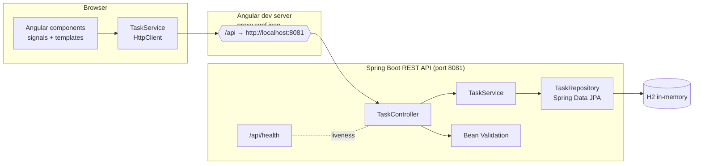

# Task Board — Angular + Spring Boot Full-Stack

[](README-pt-BR.md) [](README.md)

[](https://adoptium.net/temurin/)
[](https://spring.io/projects/spring-boot)
[](https://angular.dev)
[](https://nodejs.org)
[](#ci)
[](#testing)

> Um projeto de portfólio **full-stack completo e testado** por **Jessica Sales** (engenheira de QA/software):
> um aplicativo de página única (SPA) em **Angular 20** consumindo uma API REST em **Spring Boot 3** apoiada por um
> banco **H2** em memória, com testes, pipelines de CI e Docker em ambos os lados.

---

## Arquitetura full-stack



- O servidor de desenvolvimento do Angular faz proxy de toda solicitação `/api` para `http://localhost:8081` para que o navegador nunca
  execute uma chamada de origem cruzada (cross-origin) durante o desenvolvimento.
- O backend ainda habilita **CORS** para `http://localhost:4200` como fallback e para qualquer cliente sem proxy.
- Tudo é **testado ponta a ponta no backend** (MockMvc + repositório real) e **testado por unidade/integração
  no frontend** (Karma + Jasmine contra um backend HTTP simulado).

---

## Endpoints

| Method   | Path              | Description                          | Success | Errors                  |
| -------- | ----------------- | ------------------------------------ | ------- | ----------------------- |
| `GET`    | `/api/health`     | Sonda de vivacidade (liveness)        | `200`   | —                       |
| `GET`    | `/api/tasks`      | Listar todas as tarefas (mais recentes primeiro) | `200`   | —                       |
| `GET`    | `/api/tasks/{id}` | Buscar uma única tarefa               | `200`   | `404`                   |
| `POST`   | `/api/tasks`      | Criar uma tarefa                      | `201`   | `400` (validação)       |
| `PUT`    | `/api/tasks/{id}` | Atualizar uma tarefa                  | `200`   | `400`, `404`            |
| `DELETE` | `/api/tasks/{id}` | Excluir uma tarefa                    | `204`   | `404`                   |

**Corpo da solicitação** (`POST` / `PUT`):

```json
{
  "title": "Ship the task board",
  "description": "Optional details",
  "status": "IN_PROGRESS",
  "dueDate": "2026-12-31"
}
```

Validação: `title` é obrigatório (≤ 120 caracteres), `description` ≤ 1000 caracteres, `status` obrigatório
(`TODO | IN_PROGRESS | DONE`). Os erros são retornados como um `ProblemDetail` RFC 9457 com um mapa de `errors`
por campo.

---

## Stack de tecnologia

| Layer    | Technology                                        |
| -------- | ------------------------------------------------- |
| Backend  | Java 21, Spring Boot 3.5, Spring Web, Spring Data JPA, H2, Bean Validation |
| Testes do backend | Testes de fatia MockMvc, testes de unidade Mockito, testes de integração de contexto completo, cobertura JaCoCo |
| Frontend | Angular 20, componentes standalone, signals, HttpClient, formulários reativos/dirigidos por modelo, SCSS |
| Testes do frontend | Karma + Jasmine (`HttpClientTestingModule`) no ChromeHeadless |
| CI       | GitHub Actions: Maven `verify` + build Angular & testes headless |
| Docker   | `docker compose up` — nginx+Angular em `:8080`, API REST em `:8081` |

---

## Estrutura do projeto

```
.
├── backend/                       # API REST Spring Boot
│   ├── pom.xml
│   └── src
│       ├── main/java/com/jessicasales/portfolio
│       │   ├── config/            # CORS + dados de seed
│       │   ├── task/              # entidade, repositório, serviço, controlador, DTOs
│       │   ├── web/               # health + handler global de exceções
│       │   └── TaskApiApplication.java
│       └── test/java/...          # testes MockMvc, serviço, integração
├── frontend/                      # SPA Angular
│   ├── angular.json
│   ├── proxy.conf.json            # /api → http://localhost:8081
│   └── src/app
│       ├── core/                  # modelo de tarefa + TaskService
│       └── features/              # task-list, task-form, about
├── .github/workflows/ci.yml       # jobs de CI backend + frontend
├── docker-compose.yml             # execução opcional em container
└── README.md
```

---

## Pré-requisitos

- **Java 21** (Temurin) e **Maven 3.9+**
  (`source /c/Users/Jess/Downloads/tools/env.sh` nesta máquina Windows)
- **Node.js 24** e **npm 11+**
- (Opcional) **Docker** para a execução em container

---

## Executar localmente

### 1. Backend (Spring Boot em `:8081`)

```bash
cd backend
mvn spring-boot:run
```

Aguarde por `Started TaskApiApplication`. Verifique:

```bash
curl http://localhost:8081/api/health
# {"status":"UP",...}
curl http://localhost:8081/api/tasks
```

> O backend executa na **porta 8081**, não na 8080 padrão. O `application.properties` define a porta
> e semeia três tarefas de exemplo na inicialização (desative com `app.seed-data=false`).
> Console web do H2: http://localhost:8081/h2-console

### 2. Frontend (servidor de desenvolvimento Angular em `:4200`)

Em um **segundo terminal**:

```bash
cd frontend
npm install
npm start
```

Abra http://localhost:4200. O proxy de desenvolvimento encaminha `/api` para o backend, e o CORS está configurado para
esta origem como fallback.

---

## Testes

Execute toda a suíte do **backend** (unidade + MockMvc + integração de contexto real + cobertura):

```bash
cd backend
mvn -B clean verify
```

Execute toda a suíte do **frontend** de forma headless (Karma + ChromeHeadless):

```bash
cd frontend
export CHROME_BIN="C:/Program Files/Google/Chrome/Application/chrome.exe"   # apenas Windows
npx ng test --watch=false --browsers=ChromeHeadless --no-progress
```

Modo watch interativo: `npx ng test`. Build do frontend: `npm run build`.

---

## Teste de fumaça da API (curl)

```bash
# Listar
curl http://localhost:8081/api/tasks

# Criar
curl -X POST http://localhost:8081/api/tasks \
  -H 'Content-Type: application/json' \
  -d '{"title":"Add charts","status":"TODO"}'

# Atualizar
curl -X PUT http://localhost:8081/api/tasks/1 \
  -H 'Content-Type: application/json' \
  -d '{"title":"Add charts","status":"DONE"}'

# Excluir
curl -X DELETE http://localhost:8081/api/tasks/1 -i

# Erro de validação
curl -X POST http://localhost:8081/api/tasks \
  -H 'Content-Type: application/json' -d '{"title":"","status":"TODO"}'
```

---

## CI

[`.github/workflows/ci.yml`](.github/workflows/ci.yml) executa dois jobs independentes em todo push/PR:

- **backend** — `setup-java` (Temurin 21, cache de Maven) + `mvn -B -f backend/pom.xml verify`
- **frontend** — `setup-node` (Node 24, cache de npm) + `npm ci` + `npm run build` +
  `npx ng test --watch=false --browsers=ChromeHeadless --no-progress`

---

## O que isto demonstra

- **Disciplina full-stack** — um app Angular de componentes standalone falando HTTP com uma API Spring Boot
  em camadas (Controller → Service → Repository), com separação limpa de responsabilidades em ambos os lados.
- **Qualidade do backend** — Bean Validation com erros de campo amigáveis, respostas de problema RFC 9457,
  um handler global de exceções, CORS configurável e Java moderno (records, `stream().toList()`).
- **Testes nas duas camadas** — testes de fatia MockMvc, testes de unidade Mockito e um teste de integração de
  JPA/contexto completo no backend; testes de serviço com `HttpClientTestingModule` além de testes de componente para filtragem,
  criação, exclusão, atualização de status e tratamento de erros no frontend.
- **DX do mundo real** — proxy de desenvolvimento para chamadas cross-origin sem configuração, um README de portfólio
  fácil de configurar, CI que realmente executa ambas as suítes e um caminho Docker para executar toda a stack com um comando.

---

## Autora

Construído por **Jessica Sales** — engenheira de QA / software. Feedback e pull requests são bem-vindos.