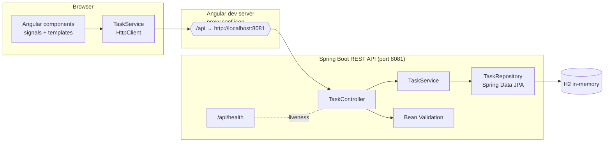

# Task Board — Angular + Spring Boot Full-Stack

[](README.md) [](README-pt-BR.md)

[](https://adoptium.net/temurin/)
[](https://spring.io/projects/spring-boot)
[](https://angular.dev)
[](https://nodejs.org)
[](#ci)
[](#testing)

> A complete, tested **full-stack portfolio project** by **Jessica Sales** (QA/software engineer):
> an **Angular 20** single-page application consuming a **Spring Boot 3** REST API backed by an
> in-memory **H2** database, with tests, CI pipelines and Docker on both sides.

---

## Full-stack architecture



- The Angular dev server proxies every `/api` request to `http://localhost:8081` so the browser never
  performs a cross-origin call during development.
- The backend still enables **CORS** for `http://localhost:4200` as a fallback and for any non-proxied client.
- Everything is **tested end-to-end on the backend** (MockMvc + real repository) and **unit/integration
  tested on the frontend** (Karma + Jasmine against a mocked HTTP backend).

---

## Endpoints

| Method   | Path              | Description                          | Success | Errors                  |
| -------- | ----------------- | ------------------------------------ | ------- | ----------------------- |
| `GET`    | `/api/health`     | Liveness probe                       | `200`   | —                       |
| `GET`    | `/api/tasks`      | List all tasks (newest first)        | `200`   | —                       |
| `GET`    | `/api/tasks/{id}` | Fetch a single task                  | `200`   | `404`                   |
| `POST`   | `/api/tasks`      | Create a task                        | `201`   | `400` (validation)      |
| `PUT`    | `/api/tasks/{id}` | Update a task                        | `200`   | `400`, `404`            |
| `DELETE` | `/api/tasks/{id}` | Delete a task                        | `204`   | `404`                   |

**Request body** (`POST` / `PUT`):

```json
{
  "title": "Ship the task board",
  "description": "Optional details",
  "status": "IN_PROGRESS",
  "dueDate": "2026-12-31"
}
```

Validation: `title` is required (≤ 120 chars), `description` ≤ 1000 chars, `status` required
(`TODO | IN_PROGRESS | DONE`). Errors are returned as an RFC 9457 `ProblemDetail` with a field-level
`errors` map.

---

## Tech stack

| Layer    | Technology                                        |
| -------- | ------------------------------------------------- |
| Backend  | Java 21, Spring Boot 3.5, Spring Web, Spring Data JPA, H2, Bean Validation |
| Backend tests | MockMvc slice tests, Mockito unit tests, full-context integration tests, JaCoCo coverage |
| Frontend | Angular 20, standalone components, signals, HttpClient, reactive/driven forms, SCSS |
| Frontend tests | Karma + Jasmine (`HttpClientTestingModule`) on ChromeHeadless |
| CI       | GitHub Actions: Maven `verify` + Angular build & headless tests |
| Docker   | `docker compose up` — nginx+Angular on `:8080`, REST API on `:8081` |

---

## Project layout

```
.
├── backend/                       # Spring Boot REST API
│   ├── pom.xml
│   └── src
│       ├── main/java/com/jessicasales/portfolio
│       │   ├── config/            # CORS + seed data
│       │   ├── task/              # entity, repository, service, controller, DTOs
│       │   ├── web/               # health + global exception handler
│       │   └── TaskApiApplication.java
│       └── test/java/...          # MockMvc, service, integration tests
├── frontend/                      # Angular SPA
│   ├── angular.json
│   ├── proxy.conf.json            # /api → http://localhost:8081
│   └── src/app
│       ├── core/                  # task model + TaskService
│       └── features/              # task-list, task-form, about
├── .github/workflows/ci.yml       # backend + frontend CI jobs
├── docker-compose.yml             # optional containerized run
└── README.md
```

---

## Prerequisites

- **Java 21** (Temurin) and **Maven 3.9+**
  (`source /c/Users/Jess/Downloads/tools/env.sh` on this Windows machine)
- **Node.js 24** and **npm 11+**
- (Optional) **Docker** for the containerized run

---

## Run locally

### 1. Backend (Spring Boot on `:8081`)

```bash
cd backend
mvn spring-boot:run
```

Wait for `Started TaskApiApplication`. Verify:

```bash
curl http://localhost:8081/api/health
# {"status":"UP",...}
curl http://localhost:8081/api/tasks
```

> The backend runs on **port 8081**, not the default 8080. `application.properties` sets the port
> and seeds three example tasks on startup (disable with `app.seed-data=false`).
> H2 web console: http://localhost:8081/h2-console

### 2. Frontend (Angular dev server on `:4200`)

In a **second terminal**:

```bash
cd frontend
npm install
npm start
```

Open http://localhost:4200. The dev proxy forwards `/api` to the backend, and CORS is configured for
this origin as a fallback.

---

## Testing

Run the **whole backend** suite (unit + MockMvc + real-context integration + coverage):

```bash
cd backend
mvn -B clean verify
```

Run the **whole frontend** suite headlessly (Karma + ChromeHeadless):

```bash
cd frontend
export CHROME_BIN="C:/Program Files/Google/Chrome/Application/chrome.exe"   # Windows only
npx ng test --watch=false --browsers=ChromeHeadless --no-progress
```

Interactive watch mode: `npx ng test`. Frontend build: `npm run build`.

---

## API smoke test (curl)

```bash
# List
curl http://localhost:8081/api/tasks

# Create
curl -X POST http://localhost:8081/api/tasks \
  -H 'Content-Type: application/json' \
  -d '{"title":"Add charts","status":"TODO"}'

# Update
curl -X PUT http://localhost:8081/api/tasks/1 \
  -H 'Content-Type: application/json' \
  -d '{"title":"Add charts","status":"DONE"}'

# Delete
curl -X DELETE http://localhost:8081/api/tasks/1 -i

# Validation error
curl -X POST http://localhost:8081/api/tasks \
  -H 'Content-Type: application/json' -d '{"title":"","status":"TODO"}'
```

---

## CI

[`.github/workflows/ci.yml`](.github/workflows/ci.yml) runs two independent jobs on every push/PR:

- **backend** — `setup-java` (Temurin 21, Maven cache) + `mvn -B -f backend/pom.xml verify`
- **frontend** — `setup-node` (Node 24, npm cache) + `npm ci` + `npm run build` +
  `npx ng test --watch=false --browsers=ChromeHeadless --no-progress`

---

## What this demonstrates

- **Full-stack discipline** — a standalone-component Angular app talking HTTP to a layered Spring Boot
  API (Controller → Service → Repository), with clean separation of concerns on both sides.
- **Backend quality** — Bean Validation with user-friendly field errors, RFC 9457 problem responses,
  a global exception handler, CORS that is configurable, and modern Java (records, `stream().toList()`).
- **Testing on both layers** — MockMvc slice tests, Mockito unit tests and a full-context JPA/integration
  test on the backend; service tests against `HttpClientTestingModule` plus component tests for filtering,
  creation, deletion, status updates and error handling on the frontend.
- **Real-world DX** — dev proxy for zero-config cross-origin calls, a set-up-friendly portfolio README,
  CI that actually runs both suites, and a Docker path for running the whole stack with one command.

---

## Author

Built by **Jessica Sales** — QA / software engineer. Feedback and pull requests welcome.